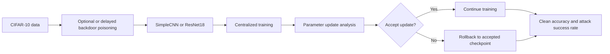
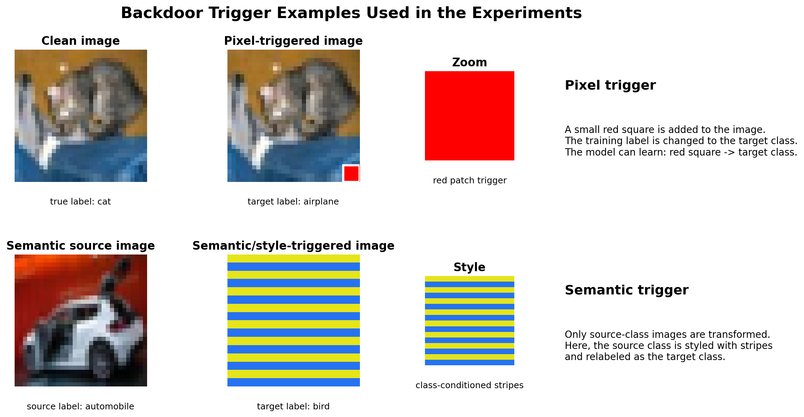
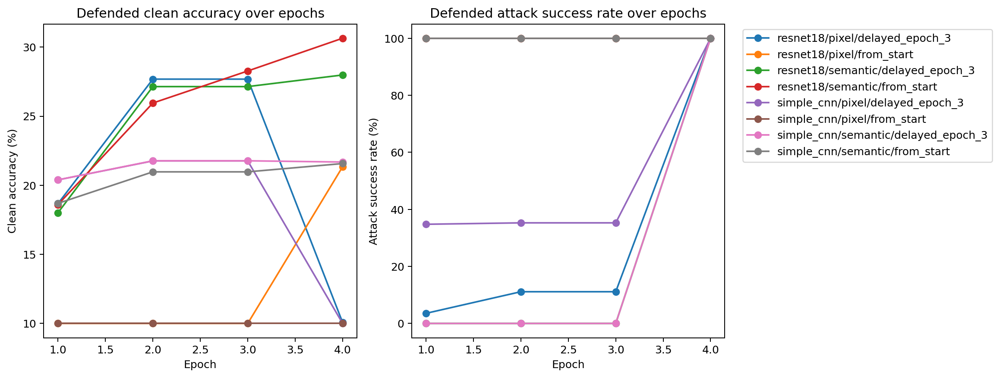
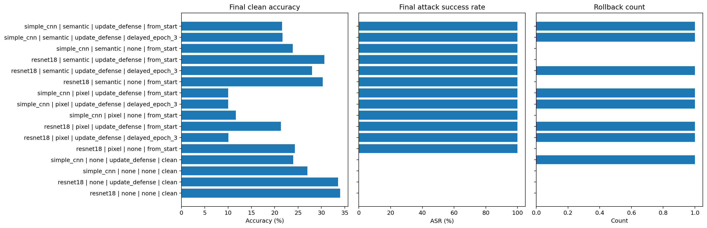

# Backdoor Robustness in CNN-Based Image Classifiers

This repository is a Deep Learning course project on CIFAR-10 image classification under backdoor attacks. The project compares a Simple CNN and ResNet18 under clean, poisoned, and defended training, then studies how attack timing changes the usefulness of parameter-update analysis with rollback.

The goal is to analyze model behavior rather than only report final accuracy. The experiments measure clean accuracy, attack success rate, rollback events, and training dynamics for pixel and semantic triggers. This makes the project a compact study of CNN robustness, optimization behavior, and architecture-dependent vulnerability to backdoor poisoning.

## Notebook workflow

`Backdoor_Robustness_CIFAR10.ipynb` is the primary interface. The notebook explains the dataset, triggers, models, experiment runner, metrics, plots, and report-ready analysis.

Presets:

| Preset   | Role                                    |
| -------- | --------------------------------------- |
| `lite`   | Short runs for sanity checks            |
| `medium` | Interactive full notebook experiments   |
| `paper`  | Longer runs for final result generation |

The same experiment logic lives in Python modules and can be invoked from `main.py` or `run_experiments.py` when batch or script execution is preferred.

## Pipeline overview

The diagram summarizes the implemented flow. CIFAR-10 training data is optionally poisoned from the start or after a clean warmup, a centralized CNN model is trained end to end, and model updates are checked against a rolling checkpoint history. Benign updates are accepted; suspicious updates can trigger rollback to the latest accepted checkpoint.



## Repository layout

```text
DL_Backdoor_Attacks/
├─ Backdoor_Robustness_CIFAR10.ipynb # narrative, experiments, figures
├─ main.py                           # shared experiment runner
├─ run_experiments.py                # optional matrix of CLI runs
├─ config.py                         # presets and experiment parameters
├─ evaluate.py                       # clean accuracy and attack success rate
├─ data/
│  ├─ dataset.py                     # CIFAR-10 loading and transforms
│  └─ backdoor.py                    # semantic and pixel triggers
├─ models/
│  └─ split_models.py                # SimpleCNN and ResNet18CIFAR definitions
├─ training/
│  └─ trainer.py                     # centralized training loop
├─ defense/
│  ├─ safesplit.py                   # update scoring and rollback
│  └─ baselines.py                   # DP and distance-based baselines
├─ results/                          # optional JSON outputs
└─ assets/readme/                    # tables and plots exported by notebook
```

## Execution

```bash
pip install -r requirements.txt
```

After installing dependencies, runs proceed in `Backdoor_Robustness_CIFAR10.ipynb` by choosing `NOTEBOOK_PRESET` among `lite`, `medium`, and `paper`. Set `RUN_EXPERIMENTS = True` to execute the matrix, or leave it `False` to load cached JSON logs from `results/`. The notebook compares poisoning from the first epoch with delayed poisoning for defended attack runs.

Equivalent CLI examples:

```bash
python main.py --preset lite --arch simple_cnn --defense none --backdoor pixel
python main.py --preset paper --arch resnet18 --defense update_defense --backdoor semantic
python main.py --preset medium --arch resnet18 --defense update_defense --backdoor semantic --poison-start-epoch 3
python run_experiments.py --preset paper
```

## Results summary

Figures and tables below were exported from `Backdoor_Robustness_CIFAR10.ipynb` under the `medium` preset. The run uses `4` epochs and `6,144` training samples, which is intentionally small enough for interactive notebook execution while still showing the relevant training dynamics.

### Trigger examples

The notebook visualizes clean, pixel-triggered, and semantic-triggered CIFAR-10 examples to make the attack setup explicit.



### Model x attack x defense comparison

The main comparison is `model x attack x defense x poison timing`. The full CSV export is written to `assets/readme/main-comparison.csv`.

| Model | Attack | Defense | Poison timing | Clean accuracy | Attack success rate | Rollbacks |
| --- | --- | --- | --- | ---: | ---: | ---: |
| Simple CNN | none | none | clean | 27.03 | 0.00 | 0 |
| Simple CNN | none | update defense | clean | 23.98 | 0.00 | 1 |
| Simple CNN | pixel | none | from start | 11.69 | 100.00 | 0 |
| Simple CNN | pixel | update defense | from start | 10.00 | 100.00 | 1 |
| Simple CNN | pixel | update defense | delayed epoch 3 | 10.00 | 100.00 | 1 |
| Simple CNN | semantic | none | from start | 23.87 | 100.00 | 0 |
| Simple CNN | semantic | update defense | from start | 21.57 | 100.00 | 1 |
| Simple CNN | semantic | update defense | delayed epoch 3 | 21.68 | 100.00 | 1 |
| ResNet18 | none | none | clean | 34.01 | 0.00 | 0 |
| ResNet18 | none | update defense | clean | 33.57 | 0.00 | 0 |
| ResNet18 | pixel | none | from start | 24.32 | 100.00 | 0 |
| ResNet18 | pixel | update defense | from start | 21.34 | 100.00 | 1 |
| ResNet18 | pixel | update defense | delayed epoch 3 | 10.07 | 99.90 | 1 |
| ResNet18 | semantic | none | from start | 30.28 | 100.00 | 0 |
| ResNet18 | semantic | update defense | from start | 30.64 | 100.00 | 0 |
| ResNet18 | semantic | update defense | delayed epoch 3 | 27.98 | 100.00 | 1 |

The clean runs establish the architecture comparison: ResNet18 reaches `34.01%` clean accuracy, while the Simple CNN reaches `27.03%`. This is expected because ResNet18 has much higher capacity and a stronger inductive structure for CIFAR-10.

Both backdoor attacks are highly effective. Pixel and semantic poisoning reach approximately `100%` attack success rate across both architectures. This confirms the main robustness result: stronger clean classification performance does not imply resistance to backdoor triggers.

### Training dynamics

The training curve plot tracks clean accuracy and attack success rate across epochs for defended poisoned runs. This is the main figure for discussing optimization dynamics, attack timing, and rollback.



The delayed-poisoning runs show the clearest defense behavior. For example, in `ResNet18 + semantic + update defense + delayed epoch 3`, the model trains clean for epochs `1-2`, poisoning starts at epoch `3`, and rollback selects checkpoint `2`. Attack success rate remains `0.0` at epoch `3`, showing that rollback can undo the first suspicious poisoned update when a cleaner checkpoint exists. At epoch `4`, poisoned training is accepted again and attack success rate jumps to `100.0`, showing that rollback alone is not a complete long-term defense.

The same pattern appears for the Simple CNN semantic delayed run: attack success rate is `0.0` before poisoning, rollback triggers at the attack onset, and attack success rises after continued poisoned training. Pixel-trigger runs are noisier because early undertrained models can already overpredict the pixel target class, but the same broader trend remains: backdoor pressure rapidly dominates once poisoned training continues.

### Final robustness panel

The final comparison panel shows clean accuracy, attack success rate, and rollback count for each model/attack/defense/timing configuration.



## Interpretation

### Architecture comparison

ResNet18 learns the clean task better than the Simple CNN in the same reduced-compute setting. However, ResNet18 is still highly vulnerable to both pixel and semantic backdoors. This separates clean generalization from backdoor robustness: a better classifier is not automatically a safer classifier.

### Backdoor vulnerability

Both attacks are successful. Semantic poisoning preserves reasonable clean accuracy while forcing triggered source-class images to the target class. Pixel poisoning is even more disruptive in some runs, especially for the Simple CNN, where clean accuracy collapses close to random guessing while attack success stays at `100%`.

### Defense behavior

The update defense is most informative when attack timing is considered. When poisoning starts at epoch `1`, rollback has no trustworthy checkpoint to recover because all stored checkpoints may already contain backdoor behavior. This explains why attack success remains saturated even when rollback triggers.

When poisoning is delayed until epoch `3`, rollback can return to an earlier clean checkpoint and temporarily suppress the backdoor at attack onset. The defense therefore works as an early-warning rollback mechanism, but it is not sufficient by itself for sustained training under continued poisoning.

## Conclusions

- ResNet18 achieves better clean accuracy than the Simple CNN, but both architectures are vulnerable to backdoor attacks.
- Pixel and semantic triggers can reach near-perfect attack success rate in only a few epochs.
- Poisoning from the beginning of training makes checkpoint rollback ineffective because earlier checkpoints are already compromised.
- Delayed poisoning shows why rollback can be useful: when clean checkpoints exist before the attack, rollback can undo the first suspicious poisoned update.
- Rollback alone is not a complete defense. Continued poisoned training can reintroduce the backdoor after rollback.
- The strongest project conclusion is that backdoor robustness depends on training dynamics and attack timing, not only on architecture choice.

## Limitations and future work

The medium preset is designed for fast interactive execution, so absolute clean accuracies are lower than they would be in longer full-data training. The results should be interpreted as a controlled training-dynamics study rather than a fully optimized CIFAR-10 benchmark.

Future work could test longer paper-preset runs, stronger rejection policies after rollback, adaptive trust thresholds, or repeated rollback/cooldown strategies. Another extension would compare additional architectures, but the current CNN comparison already captures the core deep learning robustness question.

## Metrics

- `clean_accuracy`: classification accuracy on the clean CIFAR-10 test set.
- `attack_success_rate`: fraction of triggered test samples classified as the attack target label.
- `rollback_count`: number of epochs where the update defense selected an older checkpoint instead of the latest update.
- `poison_start_epoch`: first epoch where the poisoned training dataset is used. Epoch `1` means poisoning from the start; later epochs simulate delayed attack onset.

## CLI reference

```bash
python main.py --preset lite --arch simple_cnn --defense none --backdoor none
python main.py --preset lite --arch simple_cnn --defense update_defense --backdoor pixel
python main.py --preset medium --arch simple_cnn --defense update_defense --backdoor pixel --poison-start-epoch 3
python main.py --preset paper --arch resnet18 --defense update_defense --backdoor semantic
python run_experiments.py --preset lite
python run_experiments.py --preset medium
python run_experiments.py --preset paper
```
